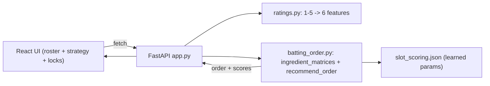

# Softball Lineup Coach — Implementation Plan

## Scope

A coach manages a **9-player roster**, rates each player on **4 simple 1-5 traits**, picks a strategy (preset or sliders), and gets an **optimized batting order** with per-slot scores, before/after change summaries, and slot locks. Defensive positioning is **removed**.

## Locked decisions

- **Player input:** simple 1-5 ratings; `ratings.py` maps them to the model's 6 features (Option B).
- **Roster size:** exactly 9 players, matching the model's 9 slots.

## Architecture

## The 1-5 -> 6-feature mapping (core new work in `ratings.py`)

Coach rates 4 traits; each maps onto the model's features (`OBP, SLG, ISO, BB%, K%, SB/game`):

- **Contact** -> up OBP, down K%
- **Power** -> up SLG, up ISO
- **Discipline** -> up BB%, down K%
- **Speed** -> up SB/game

Mechanics: rating 3 = average (z=0), linear scale (1 ~ -2 sigma, 5 ~ +2 sigma), then convert z back to raw stats using `scaler_mean`/`scaler_std` already in [backend/data/processed/slot_scoring.json](backend/data/processed/slot_scoring.json). No retraining.

## Phases

**Phase 0 - Remove positioning.** Frontend: drop the `positions` tab in [frontend/src/App.jsx](frontend/src/App.jsx); delete `PositionsPage.jsx`, `PositionField.jsx`, `usePositionAssignment.js`, `constants/positions.js`; simplify roster form to the 4 traits; update footer text. In [frontend/src/api/mockApi.js](frontend/src/api/mockApi.js) remove `getFitMatrix`/`getPositionAssignments`/`assignPositions`. Backend: delete `assignment.py`; update README structure.

**Phase 1 - Backend scaffold.** FastAPI in [backend/app.py](backend/app.py) with CORS + health endpoint. Fill [backend/requirements.txt](backend/requirements.txt): `fastapi`, `uvicorn`, `numpy`, `scipy`, `pydantic`.

**Phase 2 - Port model.** Copy `ingredient_matrices()` + `recommend_order()` from [notebooks/slot_scoring_model.ipynb](notebooks/slot_scoring_model.ipynb) into [backend/model/batting_order.py](backend/model/batting_order.py), loading `slot_scoring.json`. Implement the mapping in [backend/model/ratings.py](backend/model/ratings.py). Add a 0-100 per-slot + overall score helper matching the UI shape.

**Phase 3 - API endpoints.** Roster CRUD; `POST /batting-order` (roster + weights + locks -> `{ order, scores, overallScore, locked }`); `GET /presets`. Match `mockApi.js` field names exactly so hooks are unchanged.

**Phase 4 - Frontend wiring + strategy UI.** Replace `mockApi.js` internals with `fetch` (base URL via `.env`). Add preset buttons + weight sliders wired into [frontend/src/hooks/useBattingOrder.js](frontend/src/hooks/useBattingOrder.js) `generate()`. Disable Generate until 9 players. Keep existing lock/drag/changes banner.

**Phase 5 - Persistence.** Simple SQLite or JSON store so the roster survives restarts.

**Phase 6 - Testing.** Reproduce the notebook demo lineup; mapping sanity test (all 3s ~ average); end-to-end smoke test.

**Phase 7 - Deliverables.** Create `docs/`; fill README **Running locally**, **Team**, **AI Use Disclosure** sections.

## Critical path

Phase 0 -> 1 -> 2 -> 3 -> 4. Phases 5-7 parallelizable. The only genuinely new modeling work is the `ratings.py` mapping.
